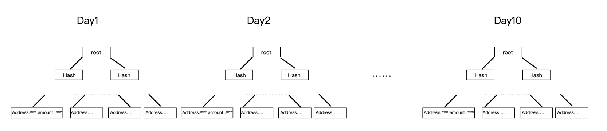
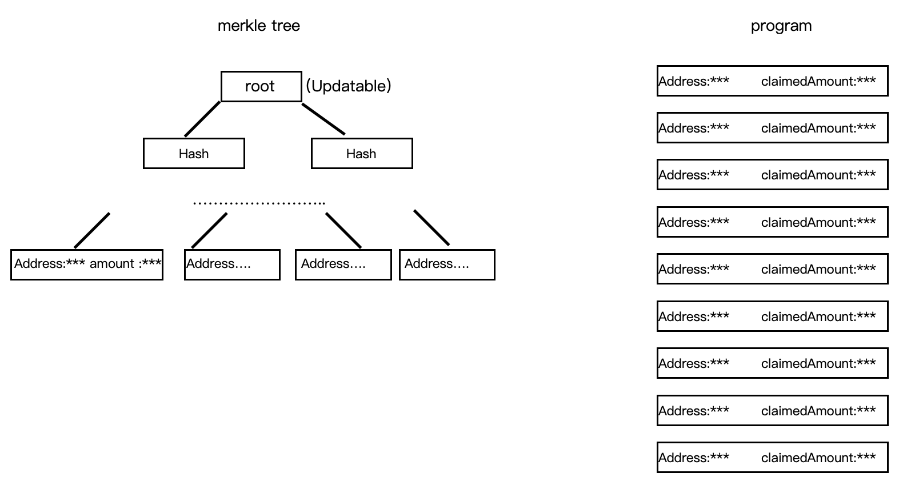

# 一个可累计分发空投的 merkle-distributor

当项目方需要针对大量用户发起空投时，一般采用将空投用户的地址存入合约中，由用户来发起认领。但在空投地址较多的场景下，该方式将产生大量存储成本，在 solana 中，被称之为 rent。目前 solana 上普遍采用[saber](https://github.com/saber-hq/merkle-distributor) 开源的 merkle-distributor。其原理是将所有空投地址生成一个 merkle root 存入合约中，用户发起认领时，需提供 merkle 证明。但该方案在项目方需要多次对用户空投、且每次空投地址存在大量重复场景下，用户必须一笔一笔进行认领，无法批量执行，其操作上较为繁琐。此外，一笔一笔操作也会产生大量的交易手续费，使得空投对用户的吸引力降低。

## 改进方案

saber 的空投方案会对每天空投的地址和数量生成一棵新的 merkle 树，并在合约中创建一个对应的的 distributor 实例。每个空投地址都有一个对应的`claim_status`记录是否已经领取，该状态关联一个唯一的 distributor 实例。


<br/>

改进后的空投方案，在第一次空投时与前者做法相同，都是将所有的地址和数量生成 merkle 树，并用该 merkle root 在合约中创建一个 distributor 实例。当第二次又发起空投时，在生成 merkle 树时，地址对应的数量需要进行累加。举个例子，地址 A 在第一天空投了 100，第二天又对地址 A 空投了 200，则第二天地址 A 对应的数量为 300。新生成的 merkle 树不再创建一个新的 distributor 实例，而是更新第一次创建的 distributor 中的 merkle root。



此外，saber 的`claim_status`用一个布尔类型记录了空投是否已经领取。改进后的方案将其换成了`claimed_amount`来标记该地址已经领取了多少数量，每一次用户可领取的数量为，当前 merkle 树中 amount 减去该数量，即：

```
claim_amount = amount_in_merkle_tree - claim_status.claimed_amount
```

该方案使得用户可在项目方多次空投后进行批量领取，从而一举解决了前面提到的操作繁琐以及手续费的问题。

最后，再次说明该方案适用于项目方需要分多次进行空投，且每次空投的用户地址存在大量重复的场景下。

## 团队

Penguin Finance [website](png.fi) [twitter](https://twitter.com/png_fi)  
Bunny Ducky [website](https://bunnyducky.com/) [twitter](https://twitter.com/BunnyDuckyHQ)
